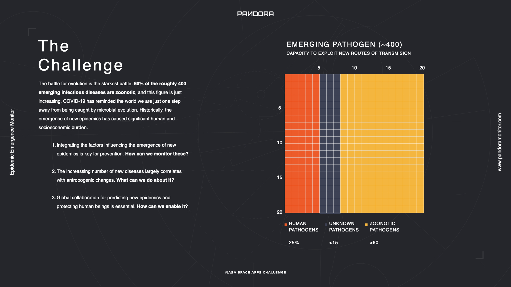
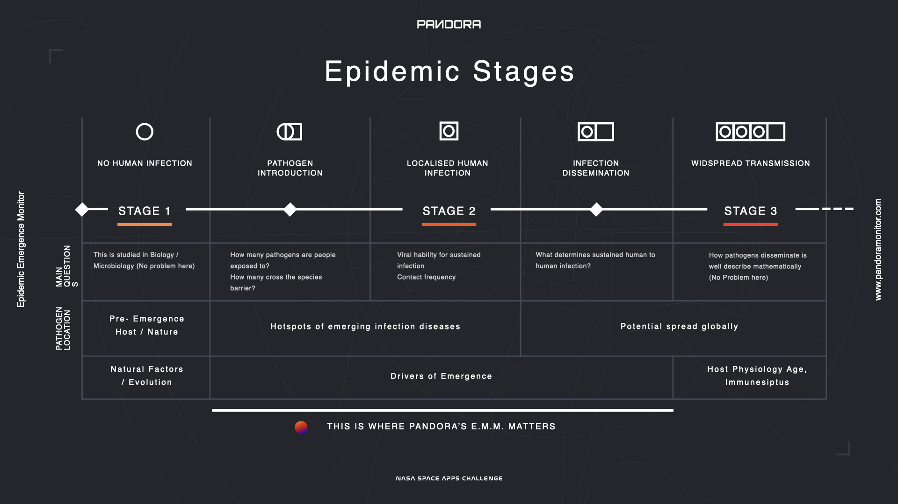
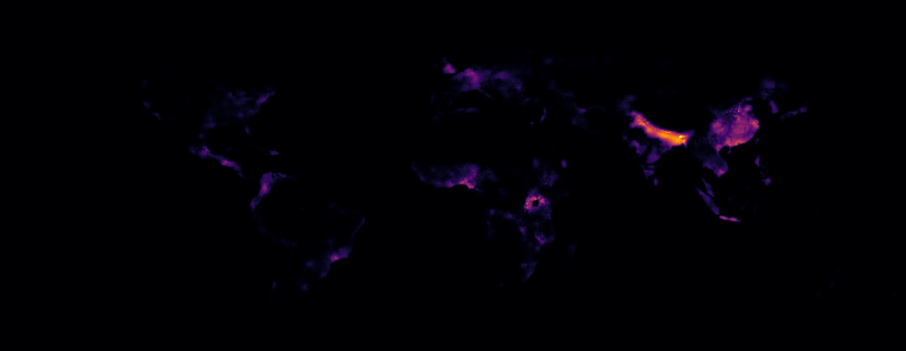

# PANDORA

Repository for [Team Pandora](https://covid19.spaceappschallenge.org/challenges/covid-challenges/human-factors/teams/pandora/project) at the Space Apps COVID-19 Challenge (May 2020).

Predict - Protect - Pandora

**Website:** [pandoramonitor.com](https://www.pandoramonitor.com)

# Video

(link)

# Epidemic Emergence Monitor

**Could we have predicted the COVID-19 outbreak?** Perhaps we were only one step away. 60% of the roughly 400 emerging infectious diseases are **zoonotic** i.e., those pathogens that have jumped from a non-human host to a human one, and this figure is just increasing. COVID-19 has reminded the world we are just one step away from being caught by microbial evolution. 

Historically, the emergence of new epidemics has caused significant human and socioeconomic burden. Scientific evidence (Morse, 2004; Morse et al., 2012, Allen et al., 2017) provides insights into the factors that influence the epidemic emergence, the so-called drivers of emergence, and alerts on the impact of anthropogenic modifications on the environment. The scientific consensus agrees on the rather urgent need of developing a tool able to strengthening the prediction of potential upcoming epidemics: *‘These vulnerabilities emphasise the need for a systematic, pre-emptive approach that aims to prevent the spread or even the initial emergence of pandemics’* (Morse et al., 2012. The Lancet). 

Pandora team has engineered the **Epidemic Emergence Monitor** bolstered by the principle by which outbreaks prediction is the best protection. 

# The Challenge

A successful **model for epidemics prediction** should take into consideration how pathogens evolve to escape from their natural hosts and colonise human beings. The emergence of an epidemic undergoes three stages: 
1. In the first stage, the pathogen, i.e., a virus, bacterium, parasite or fungi, is held into its primary host in nature. In the aims of clarity, this explanation will only address viruses and its features in regards to potential epidemic emergence. Stage 1 is mainly studied by branches of Biology, such as Molecular or Cell Biology, Evolution, and Biochemistry. Eventually, the pathogen can jump between species by acquiring or re-specialising the molecular machinery that allows it to colonize new hosts. 
2. The process by which the contagion context varies from no human infection to a localised human infection is called introduction and gives rise to stage 2. Depending on the viral ability for a sustained infection in humans and the contact frequency such humans have within the virus, the contagion curve can expand in a process called dissemination. 
3. The rapidity and efficiency of the process relies upon factors that determine the sustainability of the infection. Once the virus is disseminated, contagion context moves to stage 3 where large population groups are infected, there is widespread transmission. To which extent this phenomena of global dissemination can occur depends on the host immunity status, age and other genetic factors. 

The key steps in the progression of contagion are the introduction (stage 1 to stage 2) and dissemination (stage 2 to stage 3). When addressing the introduction step, the model needs to address the fundamental role of pathogens biology in emergence. It refers to the number and the kind of pathogens people are exposed to but also which and how these can successfully cross the species barrier and further counteract humans immunity. Given the obvious rapid variation of these parameters, it is challenging to monitor every single one of them and a complete compilation of pathogens that have been able to cross the species barrier is not available. 

However, there is scientific evidence that provides insight into two important facts to understanding the complexity of the problem. **50% of the approx. 1000 species of livestock and pets’ pathogens are zoonotic**, which means the species barrier between these and humans can be systematically breached and therefore humans can become infected. Secondly,  50% of the human pathogens can infect other vertebrates, mainly mammalian and avian species. Such figures indicate that around 1000 human helminths, 70% protozoa, 50% bacteria, 40% fungi and 80% of human viruses are zoonotic. 

Invertebrates play a role as reservoirs, vectors, or as part of the life cycle of certain parasites.  It is important to notice that zoonotic pathogens, or those which became so, can transfer from animals to humans but this is not the only direction of the contagion. Potentially, humans can transfer the virus to animals, and animals can infect other animals before going back to infect humans. This feature allows for quicker evolution and eventually enhanced pathogenicity. Out of the approx. 400 emerging pathogens, only 100 (25%) can infect humans exclusively, and so specialisation is not highly widespread. Over 60 % of these emerging pathogens are zoonotic, and the remaining 15% is not yet determined whether they may or may not infect humans as well. The proportion will depend on the number of new discoveries but also and fundamentally on the capacity to exploit new routes of colonization and transmission.

## Stages of the disease

Another important factor to take into consideration is the nature of stage 2 in epidemic emergence. Certain viruses do not require undergoing stage 2 because their capacity to infect humans becomes very successful. In such cases, once the virus has evolved to colonise humans, the contagion spreads rapidly instead of remaining in localised hotspots for a period.  It was the case for ebola virus versus SARS-CoV-2, where the former efficiently acquired the ability to infect humans and did not remain in a single contagion area for long. (FIG. 2)

# The Solution

Epidemic risk is therefore a function of the virus/host contact frequency and its successful adaptation to humans in a sustained manner. A successful adaptation to humans depends upon the virus/host relatedness, the virus’ host range and plasticity, the patterns of host/virus coevolution, and the predicted virulence in humans. Moreover, the contact frequency depends not only on the mere physical proximity between the viral and human environments, but on how the barriers preventing contagion are breached or strengthened. The concept ‘microbial traffic’ accounts for the process by which microbes disseminate from isolated groups into larger populations. The greater is the microbial traffic, the higher the risk for disease emergence and potential epidemics. The factors influencing the extent of the microbial traffic which eventually can lead to epidemic emergence are called drivers of disease emergence.

The drivers of emergence can be classified into three groups: ecological, environmental and demographic. These place human beings closer to the natural host for an unknown zoonotic virus and enable virus spreading. As these factors are increasingly prevalent, zoonotic epidemics will keep appearing with massive economic and human burden, there is a need to monitor the variance of factors and determinants of disease emergence. 

Pandora has developed the Epidemic Emergence Monitor (EEM). EEM integrates space-based assets from NASA, ESA, CNES, as well as land-based infrastructure to monitor the drivers of emergence, those parameters affecting the risk of epidemic emergence across the globe. EEM constitutes a bespoke resource for improving public health by enabling collaboration between governments, corporations, and researchers.

EEM focuses on the progression from introduction of a pathogen to its dissemination globally (stage 1 progression to stage 3, either in the presence or absence of stage 2). It leaves behind stage 1 as Biology appropriately studies this and stage 3 as how the pathogens disseminate globally is deeply studied with various and precise mathematical models. The gap in the state of the art is therefore in the transition from one to another, coincidentally, where drivers of emergence matter particularly. In that regard, EEM integrates data sources that gather positional information on key drivers of emergence such as deforestation, land use, urban and rural clusters, etc. 

The underlying principle to incorporating the drivers of emergence is the fundamental base of epidemic emergence: if natural barriers are removed or significantly modified due to the anthropogenic effect (extensive fires, deforestation, land repurposing, massive farming, etc), this allows primary hosts to become closer to humans and eventually, should selective pressure, genetic drift or further adaptation allow it, the pathogen can colonize humans: a new potential epidemic can emerge. 

Monitoring drivers of emergence is therefore of vital importance in order to predict the appearance of new epidemics which can eventually become pandemics.  

## The Model

The following expressions have been created in an attempt to model the effect of the aforementioned drivers of emergence.

*Note: all input factors have been feature-scaled from 0 to 1.*

First, the overall influence of demographic pressures has been captured in the following factor:

%20%5Ccdot%20%5Cleft(1%20%2B%202*F_%7Bwet-markets%7D%20%5Cright)%20%5Ccdot%20%5Csqrt%7B%5Cdfrac%7BF_%7Bpop-density%7D%7D%7BF_%7BGDP%7D%7D%7D%20%20%5Cright%20)),

where:

 *  indicates the nearby presence of urban areas
 *  indicates the nearby presence of wet markets, which have been identified as hot-spots of disease emergence
 *  indicates the local population density, augmenting the importance of the presence of urban areas
 *  indicates the local GDP, which has been included as a normalization factor for reporting effort

Then, four distinct drivers of emergence have been modelled from the local convergence of multple individual factors.

 1. Deforestation in high mammal biodiversity areas: 
 
 %20%20%20%20%20%20%20%20%20%20%20%20%20%20%20%20%20%20%20%20%20)

 2. Recent expansion of crop and pasture land use:

%20%20%5Cright%20)%20%20%20%20%20%20%20%20%20%20%20%20%20%20%20%20%20%20%20%20%20)

 3. Interaction between local wilflife and farm animals

%20%20%20%20%20%20%20%20%20%20%20%20%20%20%20%20%20%20%20%20%20)

 4. Major environmental disruptors

%20%5Ccdot%20F_%7Bdemographic%7D%20%20%5Cright%20)%20%20%20%20%20%20%20%20%20%20%20%20%20%20%20%20%20%20%20%20%20)

Each of these drivers of emergence increases the risk of zoonotic disease transmission from mammals to humans. Since a higher local human population also multiplies the chances of any single transmission ocurring, this has been added in the overall EMM risk factor.

%20*%20F_%7Bpop-density%7D%5Cright%20))

The image below shows the preliminary results from this risk factor calculated over the whole surface of the Earth. As we can see, it shows concentrated risk in areas such as the Ganges Basin, Southeast Asia, Nigeria, Tanzania, Uganda, Central Europe, and Central America.

# PANDORA MONITOR

**Website:** [pandoramonitor.com](https://www.pandoramonitor.com)

# The Team

- [Andrea Martos](https://www.linkedin.com/in/andrea-martos-esteban/), PhDc in Biochemistry - University of Cambridge 
- [Carlos Bort](https://www.linkedin.com/in/carlosbort/), Founder & Data scientist at xplore.ai
- [Miguel Blanco](https://www.linkedin.com/in/mblancom/), MSc Aerospace Engineering and Data Scientist
- [Pablo Talavante](https://www.linkedin.com/in/ptalavante/), Machine Learning Engineer
- [Victor Terán](https://www.linkedin.com/in/victor-teran/) Founder and Senior UX Designer at On the User

